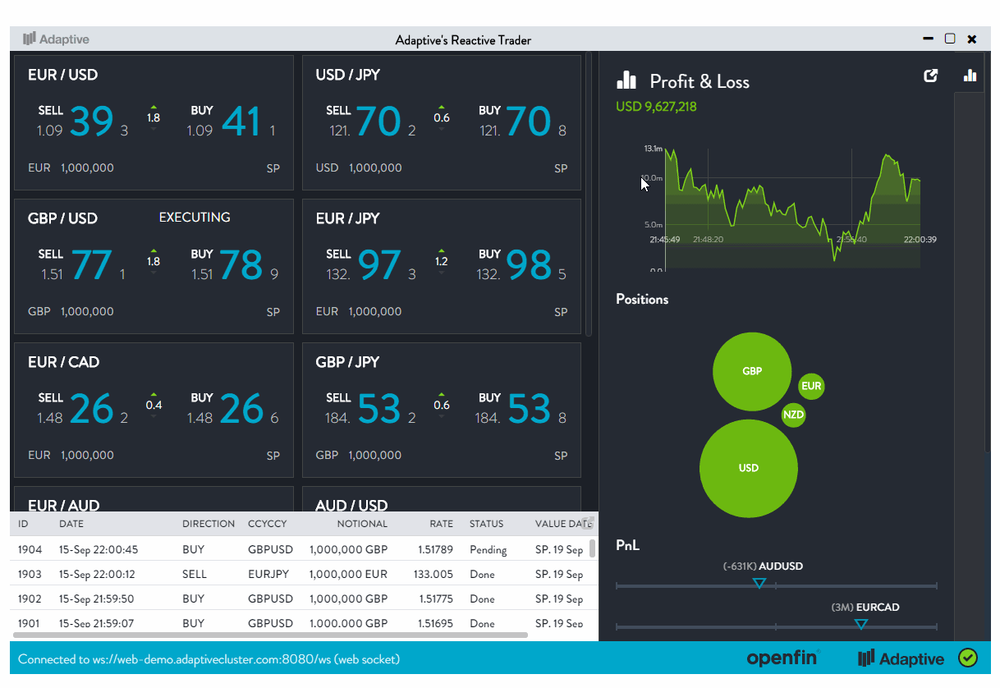

[](https://travis-ci.org/esp/esp-js)
[](https://www.npmjs.com/package/esp-js)
[](https://gitter.im/esp/chat?utm_source=badge&utm_medium=badge&utm_campaign=pr-badge&utm_content=badge)

**[Installation](#installation)** |
**[Examples](#examples)** |
**[ESP Talk](#esp-at-the-react-london-meetup-group)** |
**[Basic Usage](#basic-usage)** |
**[Help Topics](#help-topics)** 

# Evented State Processor (ESP)

ESP gives you the ability to manage changes to a model in a deterministic event driven manner.
It does this by adding specific processing workflow around changes to a model's state. 
It was born out of the need to manage complex UI and/or server state.

At its core is a `Router` which sits between event publishers and the model.
Those wanting to change the model publish events to the `Router`.
The model observes the events and applies the changes.
The model is then dispatched to model observers so new state can be applied.
It's lightweight, easy to apply and puts the model at the forefront of your design.

Get the source from [github](https://github.com/esp/esp-js) and the packages from [npm](https://www.npmjs.com/package/esp-js).

# Installation
Install from npm: `npm install esp-js --save`.

If you're using ES6 with a package manager such as [webpack](https://webpack.github.io) you can import `esp` like this:

```javascript
import esp from 'esp-js';
var router = new esp.Router();
```

Alternatively you can reference `dist\esp.js` or `dist\esp.min.js` via a `script` tag. These files expose `esp` using the Universal Module Definition (UMD) format. 

If you're using TypeScript [esp.d.ts](esp.d.ts) is referenced via the `typings` property in [package.json](package.json) so the TS compiler can discover it.

# Examples

You can find several [examples](./examples) with the source.
It's suggested you take a look at the [agile board](./examples/esp-js-react-agile-board) to get started (don't forget to read the [docs](#help-topics) first). 

## ESP Agile board

[This example](./examples/esp-js-react-agile-board/README.md) demonstrates a simple agile planning board.
It uses both [esp-js](https://www.npmjs.com/package/esp-js) and [esp-js-react](https://www.npmjs.com/package/esp-js-react) to build a unidirectional, model first application.


## Reactive Trader Cloud

[Reactive Trader Cloud](https://github.com/AdaptiveConsulting/ReactiveTraderCloud) is a more elaborate and comprehensive reference implementation done by [Adaptive Financial](http://weareadaptive.com/). 
The GUI state is modeled using [esp-js](https://www.npmjs.com/package/esp-js) with dynamic view resolution done using [esp-js-react](https://www.npmjs.com/package/esp-js-react).



# ESP at the React London Meetup group
Watch [this](https://youtu.be/Pj-RakjfHDI?t=5m33s) 25min talk on using ESP with React at the [React London meetup](https://meetup.react.london/).
Slides for the talk are available [here](http://goo.gl/40jie4).

[](https://youtu.be/Pj-RakjfHDI?t=5m33s "ESP React London Meetup Talk")

# Basic Usage

Run the below example on codepen: http://codepen.io/KeithWoods/pen/yJWLQk?editors=1012

Create an ES6 style model

```js
class LoginModel {
  constructor(modelId, router) {
    this._modelId = modelId;
    this._router = router;
    this.username = 'anonymous';
  }
  // observe events using decorators 
  @esp.observeEvent('setUsername')
  _onSetUsername(event) {
    this.username = event.username;
  }
  registerWithRouter() {
    // register the model with the router
    this._router.addModel(this._modelId, this);
    // instruct the router to hook up decorated event observation methods 
    this._router.observeEventsOn(this._modelId, this);      
  }
}
```

Create an app wide router.

```js
let router = new esp.Router();  
```


All models are identified by an ID so let's create one.

```js
let loginModelId = 'loginModelId';
```


Create an instance of your model.

```js
let loginModel = new LoginModel(loginModelId, router); 
// instruct it to register itself with the router
loginModel.registerWithRouter();
```

Observe the model for changes, typically done in a view.

```js
let subscription = router
  .getModelObservable(loginModelId)
  // the router has a built-in observable API with basic methods, where(), do(), map(), take() 
  .do(model =>  { /* gets invoked on each update */ })
  .subscribe(model => {
      console.log(`Updating view. Username is: ${model.username}`);
      // ... update the view 
    }
  );
```


Publish an event to change the models state, typically done from a view.
The router will fan-out delivery of the event to observers in your model using an [event workflow](https://keithwoods.gitbooks.io/esp-js/content/advanced-concepts/complete-event-workflow.html).
When event processing is finished the router will fan-out deliver of the model to observers.

```js
router.publishEvent(loginModelId, 'setUsername', {username:'ben'});
```

Stop observing the model
```js
subscription.dispose();      
```

Output

```
"Updating view. Username is: anonymous"
"Updating view. Username is: ben"
```

# Help Topics

[Documentation Home](https://www.gitbook.com/book/keithwoods/esp-js/details)

* [Getting Started](https://keithwoods.gitbooks.io/esp-js/content/getting-started/)
  * [Overview](https://keithwoods.gitbooks.io/esp-js/content/getting-started/overview.html)
  * [Installation](https://keithwoods.gitbooks.io/esp-js/content/getting-started/installation.html)
* [Router Api](https://keithwoods.gitbooks.io/esp-js/content/router-api/)
  * [Creating a Router](https://keithwoods.gitbooks.io/esp-js/content/router-api/creating-a-router.html)
  * [Registering a model](https://keithwoods.gitbooks.io/esp-js/content/router-api/registering-a-model.html)
  * [Event Pub/Sub](https://keithwoods.gitbooks.io/esp-js/content/router-api/event-pub-sub.html)
  * [Model Observation](https://keithwoods.gitbooks.io/esp-js/content/router-api/model-observation.html)
  * [Dispatch Loop](https://keithwoods.gitbooks.io/esp-js/content/router-api/dispatch-loop.html)
* [Modelling Approaches](https://keithwoods.gitbooks.io/esp-js/content/modelling-approaches/)
  * [Domain model](https://keithwoods.gitbooks.io/esp-js/content/modelling-approaches/domain-model.html)
  * [Event Processor Domain Model](https://keithwoods.gitbooks.io/esp-js/content/modelling-approaches/event-processor-domain-model.html)
  * [Reactive Domain Model](https://keithwoods.gitbooks.io/esp-js/content/modelling-approaches/reactive-domain-model.html)
* [Using ESP with React](https://keithwoods.gitbooks.io/esp-js/content/esp-js-react/index.html)
* [Advanced Concepts](https://keithwoods.gitbooks.io/esp-js/content/advanced-concepts/)
  * [Complete Event Workflow](https://keithwoods.gitbooks.io/esp-js/content/advanced-concepts/complete-event-workflow.html)
  * [Asynchronous Operations](https://keithwoods.gitbooks.io/esp-js/content/advanced-concepts/asynchronous-operations.html)
  * [Automatic Event Observation](https://keithwoods.gitbooks.io/esp-js/content/advanced-concepts/auto-event-observation.html)
  * [Model To Model Communications](https://keithwoods.gitbooks.io/esp-js/content/advanced-concepts/model-to-model-communications.html)
  * [Error Flows](https://keithwoods.gitbooks.io/esp-js/content/advanced-concepts/error-flows.html)
  * [Bypassing the event queue](https://keithwoods.gitbooks.io/esp-js/content/advanced-concepts/bypassing-the-event-queue.html)
  * [Anti-Patterns](https://keithwoods.gitbooks.io/esp-js/content/advanced-concepts/anti-patterns.html)
  * [Reactive API](https://keithwoods.gitbooks.io/esp-js/content/advanced-concepts/reactive-api.html)
* [Examples](https://keithwoods.gitbooks.io/esp-js/content/examples/index.html)
* [Getting Help](https://keithwoods.gitbooks.io/esp-js/content/getting-help/index.html)
* [Contribute](https://keithwoods.gitbooks.io/esp-js/content/contribute/index.html)
* [Licence](https://keithwoods.gitbooks.io/esp-js/content/licence/index.html)