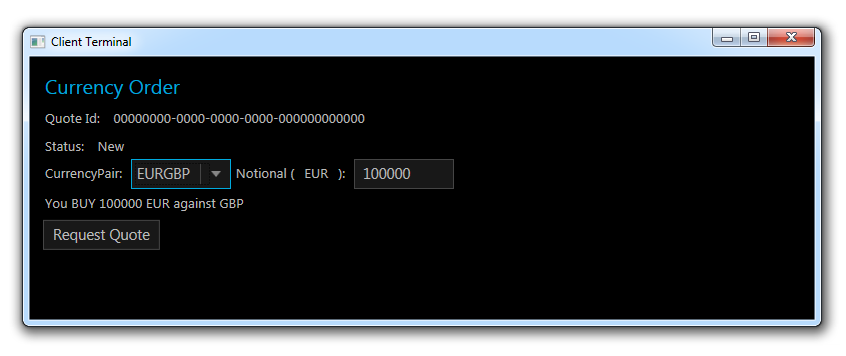
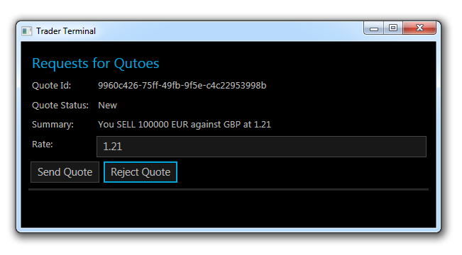

# Examples 

There is a range of examples showing how esp can be used.

Each source repository has an `examples` directory which contains all the standalone examples for that implementation.
Some of the larger ones are discussed below.

## esp-js 

### API Examples
Several example bundled into a single script to demo various aspects of the API.

Checkout the [readme](../..//examples/api/README.md) with the example for more info.

### Facebook chat example using React and a reactive model with esp-js

This example is written in ES6 using [babeljs.io](https://babeljs.io) and features the [reactive-model](../modelling-approaches/reactive-domain-model.md#reactive-model) approach.

Checkout the [readme](../..//examples/esp-chat-react-es6/README.md) with the example for more info.

### TodoMVC using React and esp-js

This example of the [MVC Todo app](http://todomvc.com) is written in ES5 and features the [event processor domain model](../modelling-approaches/event-processor-domain-model.md) approach.

Checkout the [readme](../..//examples/esp-todomvc-react/readme.md) with the example for more info.

## esp-net 

### Reactive model using esp-net 

This example shows a simplistic client/trader request for quote (RFQ) workflow build using the [reactive-model](../modelling-approaches/reactive-domain-model.md#reactive-model) approach.

Checkout the [readme](https://github.com/esp/esp-net/tree/master/examples/ReactiveModel) with the example for more info.
