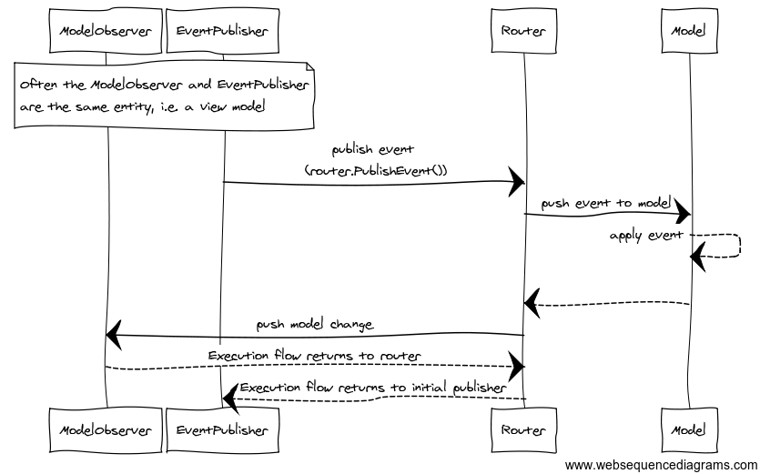

# Overview

Evented State Processing (ESP) is a pattern to update an application's model in a deterministic manner using custom defined events.

At its core is a `Router` which offers:

* The ability to register model instances.
* Event publishing functionality for those wanting to mutate a model's state.
* Event observation functionality for the model to process or react to events against it.
* Model observation functionality for those interested in observing when the model has changed.

ESP encourages true **model first development**.
It makes no assumptions about your domain modelling approach.
Various [modelling approaches](../modelling-approaches/index.md) will work with ESP as it really depends upon what you want to do.

## Do you need ESP?

Symptoms you might be looking for a model management solution:

* You are dealing with a large amount of state, complex screens with 20-200+ inputs, various workflows or maybe different representations of the same data.
* Your state shifts in real time and these changes trigger complex logic that needs processing.
* You pass objects to other objects, observe these dependent objects for changes and you sync state amongst them.
* You have a deep inheritance strategy amongst your objects (models, VMs, controllers, 'managers', strategies etc).
* You find it hard to deterministically tell where the state is and which code changes it.
* You use some form of event aggregation to send state between objects but do not have central representation of this state.
* On the GUI you've used the MV* range of patterns (MVC, MVVM, MVVMC) and have had issues managing complex state.

## Benefits

* Provides a deterministic [dispatch loop](../router-api/dispatch-loop.md) for state manipulation.
  All interested in the current event have a chance to mutate state before moving on.
* Removes the need for concurrency related code as a specific [threading model](../advanced-concepts/multithreading.md) is built in.
* Puts domain modelling at the forefront of your architecture.

## Where can it be used?

ESP can be used on both client and servers; anywhere you have complex real-time and in-memory state that requires modelling.

Within your application you may have several independent areas that manage complex state, each of these could be candidates for ESP.

*	On the client it can be used to process state for a complex screen or a set of related and complex screens.
*	It complements the MV* range of patterns by providing a deterministic method to modify and observe state.
*	On the server you might use it to model push-based user state and general internal server state. It provides a deterministic method to modify and observe such state.

## Component parts

This high level pseudo flow diagram shows the typical components parts in an ESP based system/sub-system.

The ESP package gives you the `Router`. It's API allows model registration and event pub/sub.
The `Router` sits in between those wanting to change the model and the model itself.

> ##### Note
>There are some useful tools for modelling, threading and advanced workflows available in the distributions but these not required.
>
>All you need to get started is the `Router`.
>How you use the `Router` to build fully functional event based systems is the focus of [modelling approaches](../modelling-approaches/index.md) with [examples](../examples/index.md) providing practical guidance.