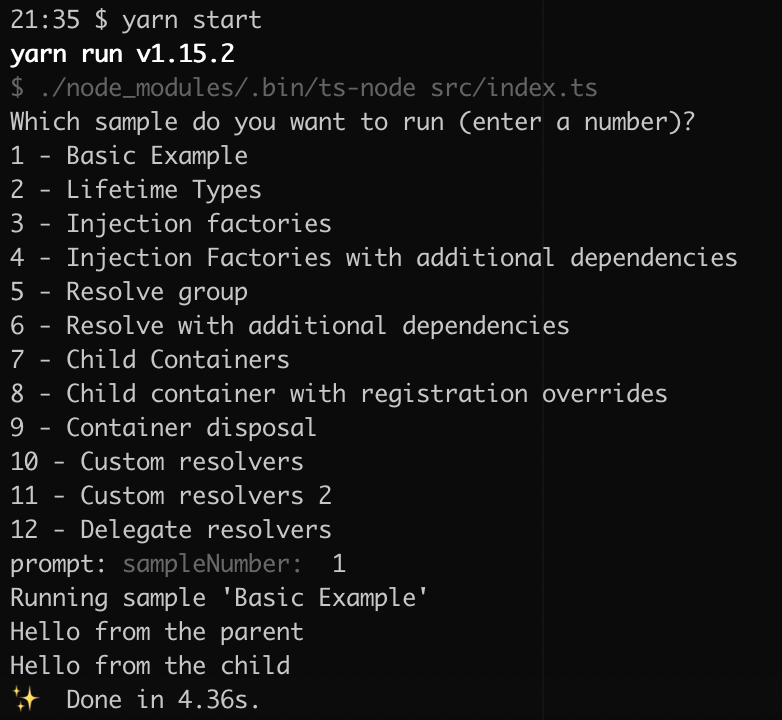

# esp-js-di examples

The [examples](src/examples.ts) cover the main features of the container, they are fairly self explanatory.
  
To get a feel for the container you can use these as a test bed to try out features.

The container is a stand-alone package, it has no dependency on other esp packages. 

## Running

You must have [yarn](https://yarnpkg.com/) or yarn installed on your computer.

From the root directory of the repo first do a yarn install:

`yarn install`

This will install all dependencies and setup the mono repo structure.

Next build all the esp packages:

`yarn build-dev`
 
Then cd into the example you want to run:

`cd example/the-example-directory`

And finally start the example:

`yarn start`

This example runs in the console:

