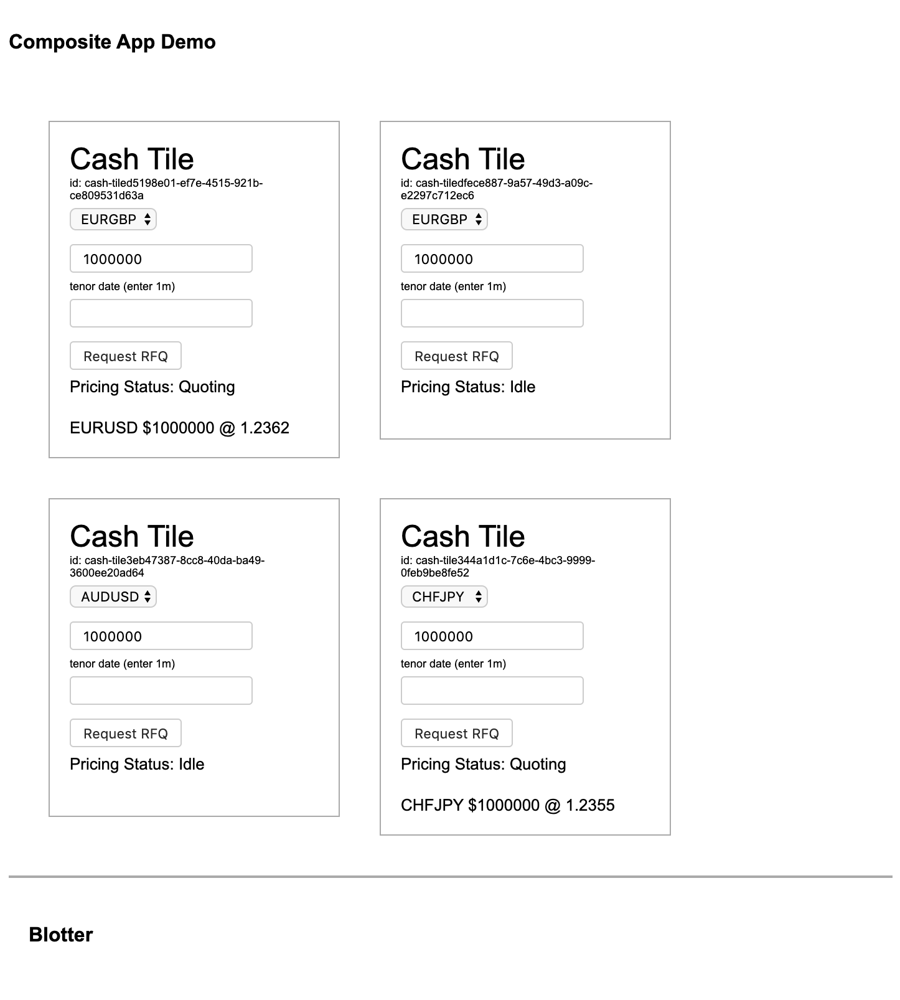

# Evented State Processor (ESP) Module Based App Example 

This example demonstrates features of esp-js-ui.

## Running

You must have [yarn](https://yarnpkg.com/) or yarn installed on your computer.

From the root directory of the repo first do a yarn install:

`yarn install`

This will install all dependencies and setup the mono repo structure.

Next build all the esp packages:

`yarn build-dev`
 
Then cd into the example you want to run:

`cd example/the-example-directory`

And finally start the example:

`yarn start`

Browse to [http://localhost:4000](http://localhost:4000) to view the example.

